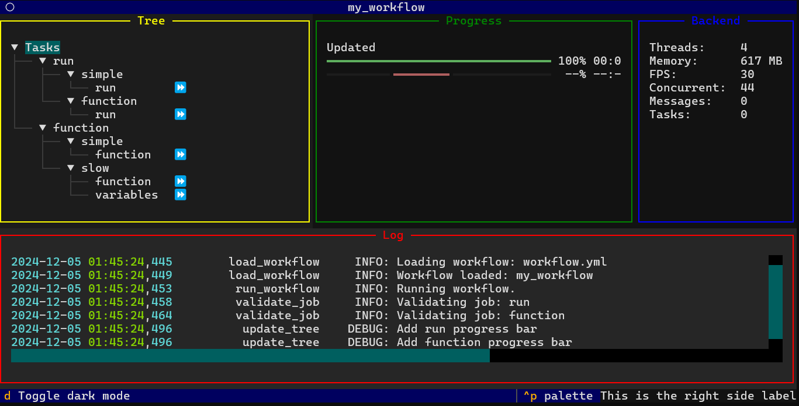

# Workflow Manager

A workflow manager and a textual GUI, very work in progress.



```bash
pip install .
python myproject/cli.py --workflow workflow.yml
```

## To-Do

- Port dynamic parsing code from `main_old.py` to `workflow.py`.
- Move backend elements from `gui.py` to `workflow.py` such as the task tree.
- Convert all executors to async tasks.
- Think about imposing resource constraints with: `resource.setrlimit()`.